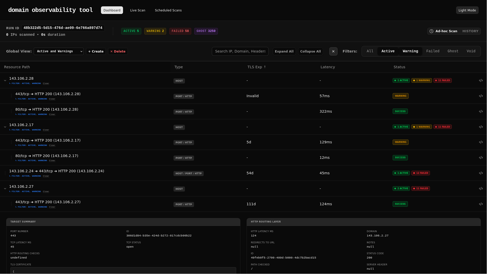
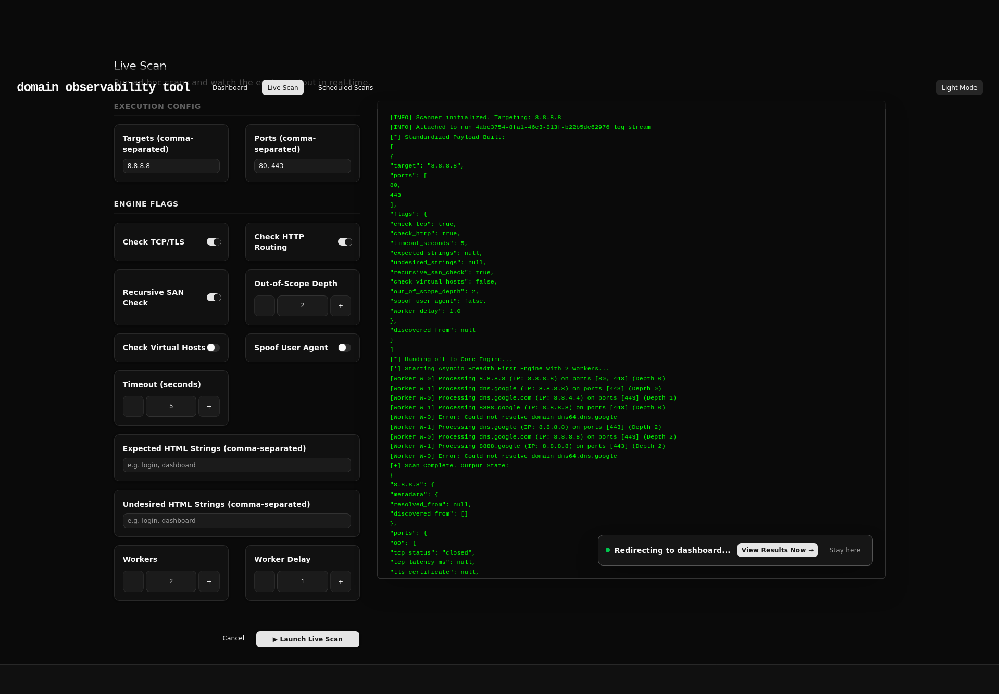
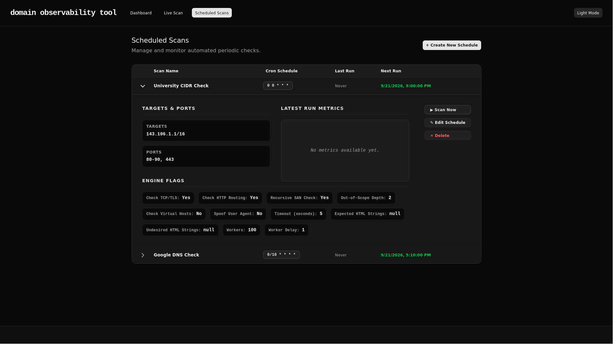

<div align="center">

# Site Health Check
*Monitoramento blackbox de rede e infraestrutura*

[](#)

[Funcionalidades](#funcionalidades) • [Targets Suportados](#targets-suportados) • [Instalação](#instalação) • [Arquitetura](#arquitetura)

</div>

O Site Health Check testa a disponibilidade e o tempo de resposta da sua infraestrutura de fora para dentro, sem precisar de agentes instalados nos servidores. Consiste em uma interface de filtragem e display combinada a uma engine de coleta.

> [!NOTE]
> O projeto está na fase de MVP. A engine de execução é estável, enquanto o frontend continua recebendo iterações focadas em usabilidade.

## Funcionalidades

- **Schedules Automáticos** - Configure a frequência (ex: a cada 5 minutos) e a engine dispara testes sequenciais contra os targets mapeados.
- **Recursive SAN Check** - Ao analisar certificados TLS/SSL, a engine extrai automaticamente os Subject Alternative Names (SANs) e pode mapeá-los/escaneá-los de forma recursiva.
- **Histórico Consolidado** - Base de dados para analisar estabilidade, identificar lentidões recorrentes e falhas em horários de pico.
- **Filtragem Avançada** - A interface permite investigar a rede isolando serviços específicos, mesmo dentro de blocos de IP muito amplos.

## O que a engine coleta

Em cada requisição de rede, os seguintes dados são processados:
- Tempo total de resposta (latências TCP e HTTP)
- Status de disponibilidade e redirecionamentos
- Resoluções de DNS e Headers do servidor
- Dados de certificados TLS/SSL (validação, expiração, issuer e versão do protocolo TLS)

## Targets Suportados

A flexibilidade de configuração permite definir *targets* com alta granularidade. Exemplos:

- **Domínios e URLs:** `https://api.exemplo.com.br/health`
- **Ranges de IPs (CIDR):** `192.168.1.0/24` ou `10.0.0.0/8` para varreduras em blocos inteiros.
- **Portas Específicas:** Testes focados em serviços não padronizados, ex: `10.0.0.50:8080`.

## Capturas de Tela

**Dashboard**  
Visão geral com o status consolidado da infraestrutura para validação rápida de interrupções ativas.  


**Live Scan**  
Permite disparar varreduras imediatas para investigar o comportamento dos targets em tempo real.  


**Scheduled Scans**  
Adicione e gerencie rotinas automáticas de execução, ajustando a frequência e os parâmetros para o monitoramento contínuo.  


## Avisos de Uso

> [!WARNING]
> Isso é uma ferramenta de monitoramento externo. Não substitui o profiling interno da aplicação (ex: descobrir em qual tabela do banco de dados uma query engasgou).

> [!CAUTION]
> Cuidado com rate limits. Configurar schedules agressivos em infraestruturas que você não controla pode resultar no bloqueio do seu IP ou gerar negação de serviço acidental. O objetivo é monitorar, não sobrecarregar.

## Instalação

**Pré-requisitos:**
- Container runtime (Docker ou Podman)
- Ambientes Python e Node.js (Apenas para desenvolvimento local fora de containers)

1. Clone o repositório e abra o terminal na raiz.
2. Inicie os containers:
   ```bash
   docker compose up --build -d
   ```
3. Acesse:
   - **Frontend:** `http://localhost:8080`
   - **Backend API:** `http://localhost:8000`

## Arquitetura

O projeto é dividido em três frentes principais:
1. **Frontend:** Interface SPA interativa no navegador.
2. **Backend (API):** Gerencia os schedules, recebe configurações e serve os dados coletados (construído em FastAPI).
3. **Engine:** O executor independente que realiza as chamadas de rede e coleta os dados brutos.

Para desenvolvimento local do backend (utilizando o [Poetry](https://python-poetry.org/)):
```bash
cd engine && poetry install
cd ../api && poetry install
```

A documentação interativa da API (Swagger/ReDoc) pode ser acessada em `http://localhost:8000/docs` com o backend em execução.