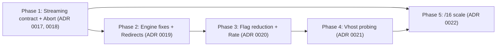

# 07 — Engine v2 Roadmap: Priorities & Execution Order

Phases are ordered by **priority first, then correlation**: changes that touch the same
code or the same contract ship together, and each phase only depends on earlier ones.
Architectural decisions live in ADRs. Small fixes that don't deserve an ADR are listed
inline.

---

## Phase 1 — Engine invocation contract & run abort

**ADRs:** [0017](adr/0017-engine-streaming-output-contract.md), [0018](adr/0018-scan-run-abort-and-partial-results.md)

**Why first:** this phase fixes the "crash = zero results" problem, unblocks progressive
ingestion and abort, and every later phase emits data through this contract.

**Engine**
- [ ] Replace `print` with `logging` → stderr; `-v`/`-q`. Stop echoing the input payload.
- [ ] NDJSON delta writer on stdout (one line per finished TCP/TLS or HTTP probe) +
      final `summary` line.
- [ ] Shared `merge_delta()` function; `-o` builds the aggregated JSON from it.
- [ ] SIGTERM/SIGINT handler: stop dequeuing, cancel workers, write summary, exit 143/130.
- [ ] Tests: deltas fold into the current format; SIGTERM leaves valid lines + summary.

**API**
- [ ] Move `run_engine_cli` → `services/runner.py`.
- [ ] Concurrent readers: stdout → batched upsert ingestion (`asyncio.to_thread`),
      stderr → SSE.
- [ ] Unique constraints for upserts (reset dev DB — no migrations yet).
- [ ] `ScanRunStatus.ABORTED`, process registry, `POST /api/runs/{id}/abort`.
- [ ] Startup reconciliation (`RUNNING`/`PENDING` → `FAILED`, `reason: api_restart`);
      terminate children on shutdown.
- [ ] Metrics computed from DB at the end, `partial: true` for ABORTED/FAILED.
- [ ] SSE stream treats `ABORTED` as terminal; optional `progress` event (hosts done).
- [ ] Historical diff and "latest run" default only use `COMPLETED` runs.

**Frontend**
- [ ] Regenerate types; **Stop** button in LiveScan; rename current Cancel → **Detach**.
- [ ] `ABORTED` badge; "partial results" banner on ABORTED/FAILED runs.

---

## Phase 2 — Engine correctness & performance fixes

**ADRs:** [0019](adr/0019-http-redirect-first-hop-semantics.md)

**Why here:** these fixes stay inside the engine and need no API or UI changes. The
first item is probably the largest single speed-up on big ranges.

- [ ] **Skip HTTP when TCP is not open.** Today a filtered port costs 2 s TCP timeout +
      10 s HTTP timeout. For vhost tasks that skip TCP, await the in-flight TCP result
      (store a future per `ip:port`) instead of reading the pre-initialized
      `closed` default.
- [ ] Redirects: `allow_redirects=False` + `Location` → `redirects_to_url` (ADR 0019).
      Update the `HttpRoutingCheck` entry in `CONTEXT.md`.
- [ ] Use `aiohttp.ClientTimeout` (passing a bare int is deprecated). Make the TCP
      timeout configurable instead of the hard-coded `2.0`.
- [ ] Engine module-level globals (`master_state`, `seen_*`) → an `EngineRun` object
      (prepares phases 4/5 and makes tests isolated).
- [ ] Dead code: `normalize_url` (if unused), `exporter` reading `results["target"]`
      from an IP-keyed dict.

---

## Phase 3 — Execution flag reduction & global rate limiting

**ADRs:** [0020](adr/0020-execution-flags-reduction-and-rate-limiting.md)

**Why grouped:** every item touches the same three places (CLI, `ExecutionFlags`,
`ScanConfigForm`) plus one type regeneration.

- [ ] Remove `check_tcp`, `--push-url`, `spoof_user_agent`, `expected`/`undesired`,
      `catcher.py`.
- [ ] Implement `--no-check-http` (TLS/SAN-only mode).
- [ ] Fixed honest User-Agent; CLI-only `--user-agent`.
- [ ] `--rate` token bucket applied per connection attempt; remove `delay`.
- [ ] Parallelize ports inside a task (bounded by `--workers`/`--rate`).
- [ ] Frontend form + types.

---

## Phase 4 — Correct vhost probing

**ADRs:** [0021](adr/0021-dns-independent-vhost-probing.md) *(Proposed — open
question on SNI cert storage)*

**Why after phase 3:** it multiplies probes per IP, so it needs `--rate` and the
streaming contract in place.

- [ ] SAN → in-scope probe on the origin IP without DNS.
- [ ] TLS dedup key `ip:port:sni`; harvest SANs from SNI certs.
- [ ] `--max-vhosts-per-ip`, wildcard recording, `aiodns` with all A records.

---

## Phase 5 — /16 scale

**ADRs:** [0022](adr/0022-slash16-scale-strategy.md) *(Proposed)*

- [ ] Lazy, shuffled target generator in the engine.
- [ ] Drop emitted state when `-o` is not set.
- [ ] `GET /runs/{id}/summary?group=24` + `?cidr=` filter on results.
- [ ] Frontend /24 drill-down above a host threshold.

---

## Backlog (not scheduled)

- Single connection for TLS + HTTP ("double handshake") → natural in Go (ADR 0006).
- Multi-process engine split per CIDR slice; crash resume via `--exclude-from`.
- `--format tsv` for awk-first terminal use.
- Alembic migrations (unblocks `title` capture and ADR 0021 option B).
- HTML `<title>` capture.
